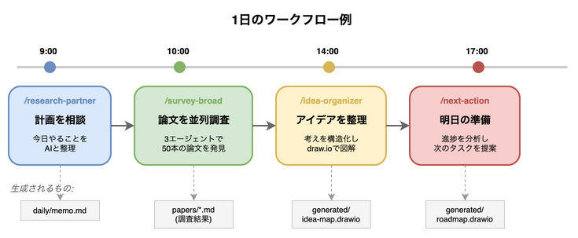

# Research with AI on Your Shoulder


## 特徴

- **並列エージェント**: 複数AIが同時に論文調査
- **6つの専門スキル**: 調査、整理、提案を自動化
- **ナレッジ管理**: themes/papers/dailyの3層構造


## 使い方



## セットアップ

```bash
pip install pre-commit && pre-commit install
```

`/research-partner` で開始

## ディレクトリ構成


## 詳細

- [framework/README.md](framework/README.md)
- [content/README.md](content/README.md)
