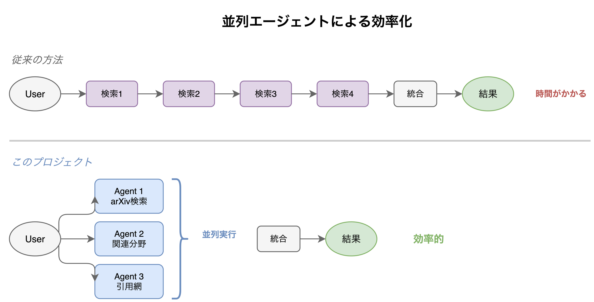

# Research with AI on Your Shoulder

**研究者のためのAIエージェント基盤。論文調査からアイデア整理まで、複数のAIが並列で支援します。**

<p align="center">
  
</p>

## 特徴

### 並列エージェントによる効率化

複数のAIエージェントが同時に動作し、論文調査を高速化します。

<p align="center">
  
</p>

### 研究コンテキストの理解

`content/themes/` に登録した研究テーマをAIが参照し、あなたの研究分野に最適化された支援を提供します。

### 知識の構造化

調査結果やアイデアは `content/` ディレクトリに自動で整理され、再利用可能な形で蓄積されます。

## スキル一覧

| スキル | 機能 |
|--------|------|
| `/research-partner` | 研究の相談。タスクの整理と適切なスキルへの委譲 |
| `/survey-broad` | 並列エージェントによる広範囲の論文調査 |
| `/survey-focused` | 特定テーマに絞った深い調査 |
| `/idea-organizer` | アイデアの構造化と図解 |
| `/related-work` | メモから関連研究を発見 |
| `/next-action` | 進捗分析と次のアクション提案 |

## 始め方

```bash
# クローン
git clone https://github.com/your-repo/research-with-AI-on-your-shoulder.git
cd research-with-AI-on-your-shoulder

# 依存関係のインストール
pip install pre-commit && pre-commit install
npm install

# 研究テーマを登録（テンプレートをコピーして編集）
cp framework/templates/theme.md content/themes/my-theme.md

# Claude Codeを起動して /research-partner と入力
```

## ディレクトリ構成

```
content/
├── themes/      # 研究テーマの定義
├── papers/      # 論文ノート
├── daily/       # 日次メモ
└── generated/   # AI生成コンテンツ
```
