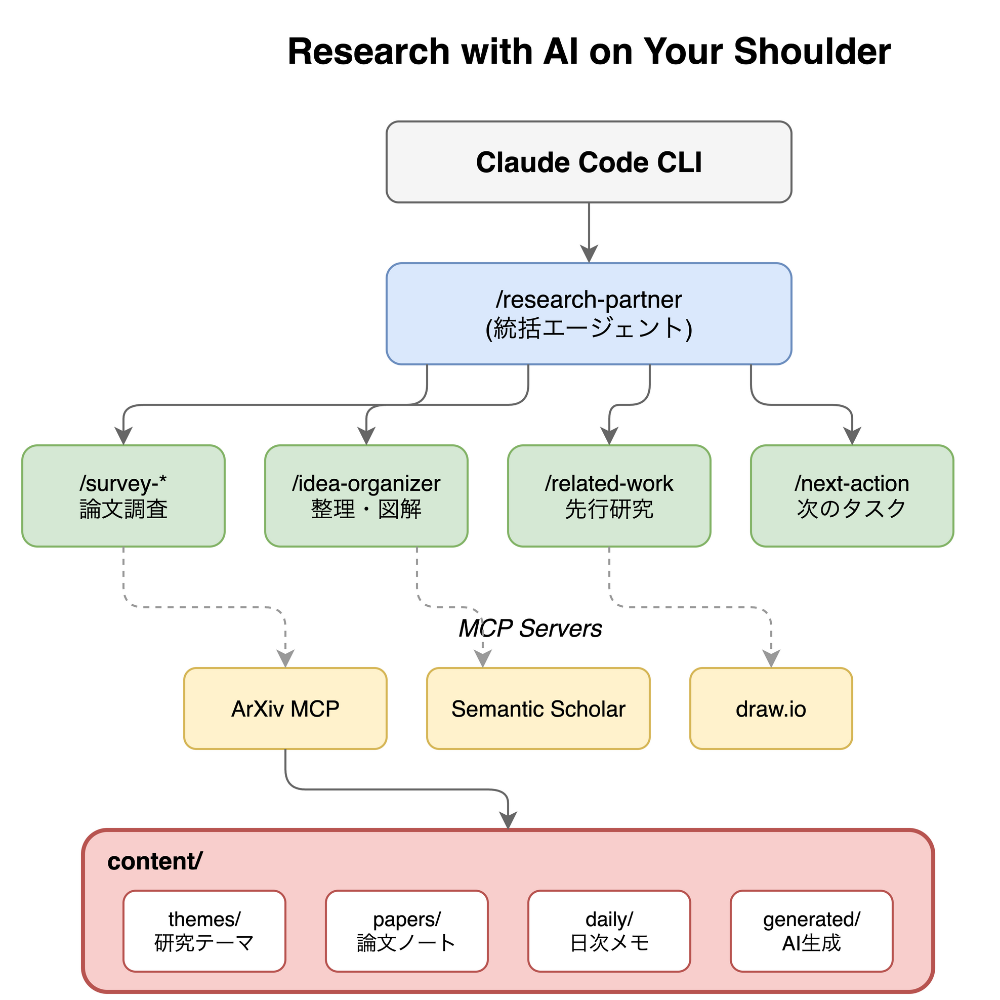

# Research with AI on Your Shoulder

研究者のためのAIエージェント基盤。論文調査からアイデア整理まで、AIが並列で支援します。

<p align="center">
  
</p>

## 特徴

- **研究特化スキル**: 論文調査、関連研究の発見、アイデア整理、次のアクション提案など、研究ワークフローに最適化
- **並列エージェント**: 複数のAIエージェントが同時に動作し、広範囲の論文調査を高速化
- **コンテキスト理解**: 研究テーマを登録すると、AIがあなたの分野に合わせた支援を提供
- **知識の蓄積**: 調査結果やアイデアが `content/` に整理され、再利用可能な形で蓄積

## 始め方

```bash
git clone https://github.com/your-repo/research-with-AI-on-your-shoulder.git
cd research-with-AI-on-your-shoulder
npm install
```

Claude Codeを起動し、`/research-partner` と入力して研究相談を開始。

## 主なスキル

| スキル | 機能 |
|--------|------|
| `/research-partner` | 研究相談の統括。適切なスキルへ委譲 |
| `/survey-broad` | 広範囲の並列論文調査 |
| `/survey-focused` | 特定テーマの深い調査 |
| `/paper-reader` | 論文の解説・Q&A |
| `/idea-organizer` | アイデアの構造化・図解 |
| `/next-action` | 次のアクション提案 |
